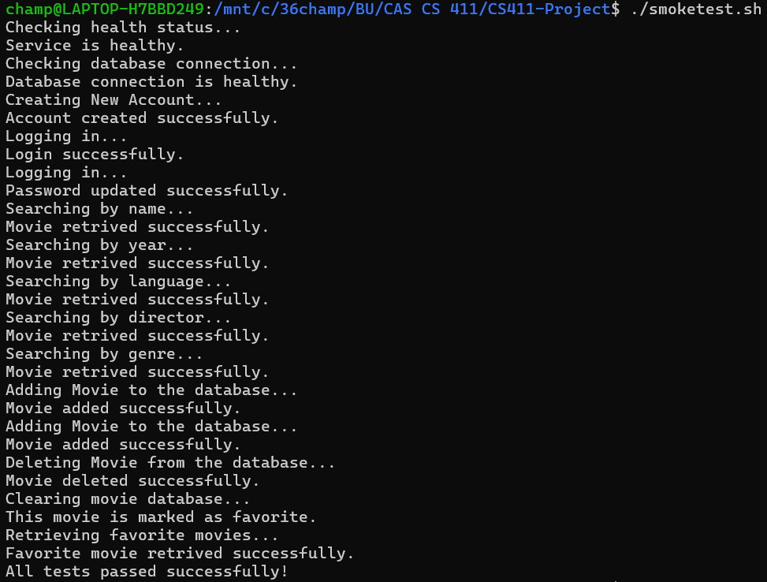
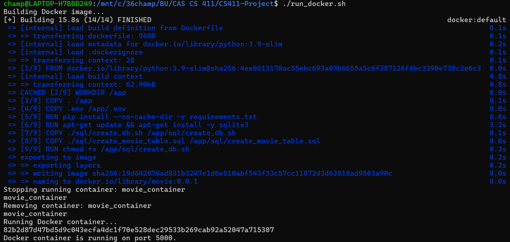

# Movie Catalog API Documentation

This App allows users to search, add, delete, and manage a movie catalog.

## Routes

### Route: /movies/search-by-name
- **Request Type:** POST
- **Purpose:** Get a random movie by name.
- **Request Body:**
  - name (String): The name of the movie to search for.
- **Response Format:** JSON
  - **Success Response Example:**
    ```json
    {
        "status": "success",
        "name": "Inception",
        "year": 2010,
        "director": "Christopher Nolan",
        "genres": "Action,Sci-Fi",
        "original_language": "English"
    }
    ```
  - **Error Response Example:**
    ```json
    {
        "error": "Movie name is required"
    }
    ```

### Route: /movies/search-by-year
- **Request Type:** POST
- **Purpose:** Get a random movie from a specific year.
- **Request Body:**
  - year (Integer): The year to search for.
- **Response Format:** JSON
  - **Success Response Example:**
    ```json
    {
        "status": "success",
        "name": "Inception",
        "year": 2010,
        "director": "Christopher Nolan",
        "genres": "Action,Sci-Fi",
        "original_language": "English"
    }
    ```
  - **Error Response Example:**
    ```json
    {
        "error": "Year must be a valid integer"
    }
    ```

### Route: /movies/search-by-language
- **Request Type:** POST
- **Purpose:** Search for movies by original language.
- **Request Body:**
  - language_code (String): The language code to search for.
- **Response Format:** JSON
  - **Success Response Example:**
    ```json
    {
        "status": "success",
        "name": "Inception",
        "year": 2010,
        "director": "Christopher Nolan",
        "genres": "Action,Sci-Fi",
        "original_language": "English"
    }
    ```
  - **Error Response Example:**
    ```json
    {
        "error": "Language code is required"
    }
    ```

### Route: /movies/search-by-director
- **Request Type:** POST
- **Purpose:** Search for movies by director name.
- **Request Body:**
  - director (String): The name of the director to search for.
- **Response Format:** JSON
  - **Success Response Example:**
    ```json
    {
        "status": "success",
        "name": "Inception",
        "year": 2010,
        "director": "Christopher Nolan",
        "genres": "Action,Sci-Fi",
        "original_language": "English"
    }
    ```
  - **Error Response Example:**
    ```json
    {
        "error": "Director name is required"
    }
    ```

### Route: /movies/search-by-genre
- **Request Type:** POST
- **Purpose:** Search for movies by genre ID.
- **Request Body:**
  - genre_id (Integer): The ID of the genre to search for.
- **Response Format:** JSON
  - **Success Response Example:**
    ```json
    {
        "status": "success",
        "name": "Inception",
        "year": 2010,
        "director": "Christopher Nolan",
        "genres": "Action,Sci-Fi",
        "original_language": "English"
    }
    ```
  - **Error Response Example:**
    ```json
    {
        "error": "Genre ID must be a positive integer"
    }
    ```

### Route: /movies/add-to-list
- **Request Type:** POST
- **Purpose:** Add a movie to the database.
- **Request Body:**
  - name (String): The name of the movie.
  - year (Integer): The release year of the movie.
  - director (String): The director of the movie.
  - genres (List): A list of genres associated with the movie.
  - original_language (String): The original language of the movie.
  - favorite (Boolean, optional): Whether the movie is marked as a favorite (Defaults to False).
- **Response Format:** JSON
  - **Success Response Example:**
    ```json
    {
        "status": "success"
    }
    ```
  - **Error Response Example:**
    ```json
    {
        "error": "Movie name is required"
    }
    ```

### Route: /movies/delete-from-list
- **Request Type:** DELETE
- **Purpose:** Soft deletes a movie from the catalog by marking it as deleted.
- **Request Body:**
  - movie_id (Integer): The ID of the movie to delete.
- **Response Format:** JSON
  - **Success Response Example:**
    ```json
    {
        "status": "success"
    }
    ```
  - **Error Response Example:**
    ```json
    {
        "error": "Movie ID must be a valid integer"
    }
    ```

### Route: /movies/clear-list
- **Request Type:** DELETE
- **Purpose:** Recreates the movie table, effectively deleting all movies.
- **Response Format:** JSON
  - **Success Response Example:**
    ```json
    {
        "status": "success"
    }
    ```
  - **Error Response Example:**
    ```json
    {
        "error": "An error occurred while clearing the database"
    }
    ```

### Route: /movies/mark-as-favorite
- **Request Type:** POST
- **Purpose:** Marks a movie as a favorite in the database.
- **Request Body:**
  - name (String): The name of the movie to mark as favorite.
- **Response Format:** JSON
  - **Success Response Example:**
    ```json
    {
        "status": "success"
    }
    ```
  - **Error Response Example:**
    ```json
    {
        "error": "Movie name is required"
    }
    ```

### Route: /movies/list-favorite
- **Request Type:** GET
- **Purpose:** Fetches the names of all favorite movies from the database.
- **Response Format:** JSON
  - **Success Response Example:**
    ```json
    {
        "status": "success",
        "favorite_movies": ["Inception", "The Dark Knight"]
    }
    ```
  - **Error Response Example:**
    ```json
    {
        "error": "An error occurred while retrieving favorite movies"
    }
    ```

---

## Extra Documentation
Steps to run app:
- 1. Get the API Key from: https://developer.themoviedb.org/reference/intro/getting-started
- 2. Put it in movie_collection/movie_model.py
- 3. Run run_docker.sh
- 
- 
